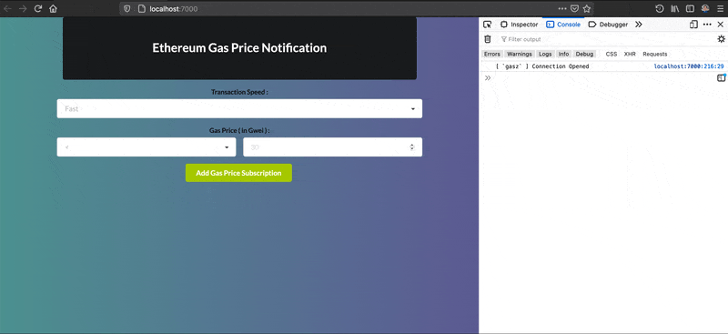
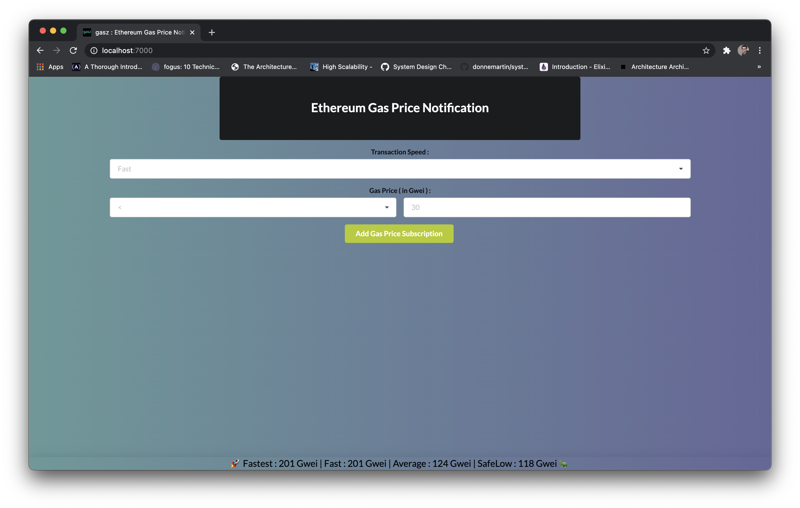
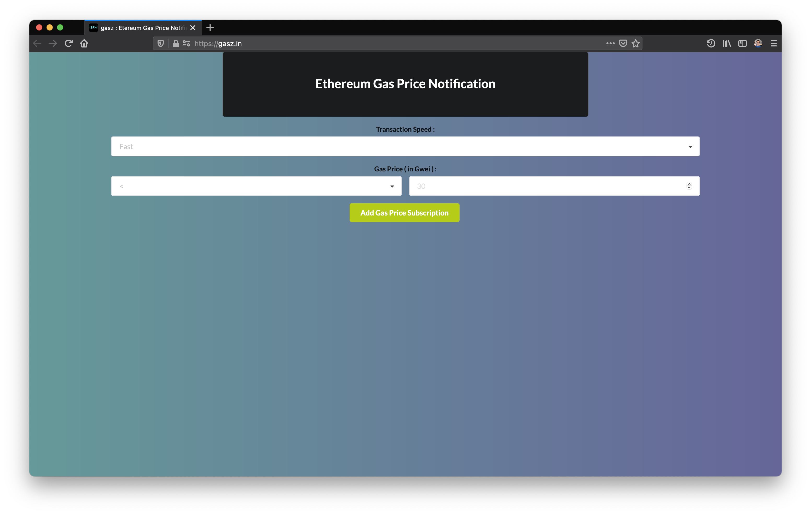
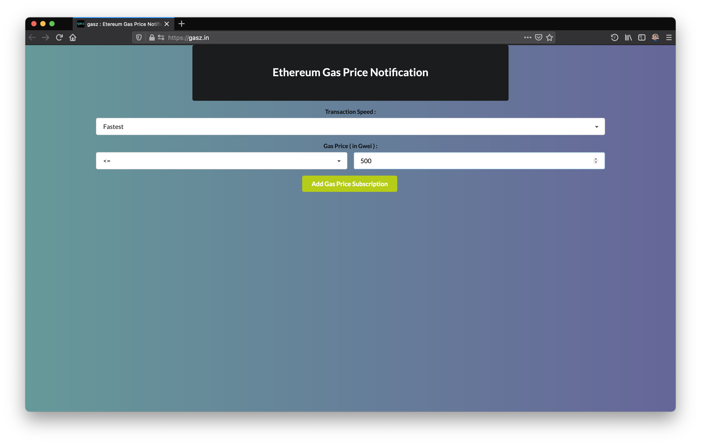
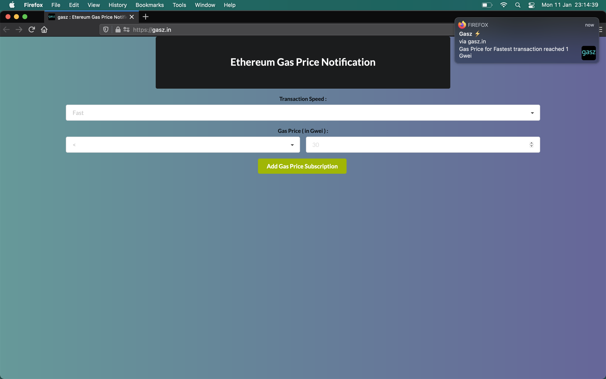

# gasz

Ethereum Gas Price Notifier @ [gasz.in](https://gasz.in)



**Update 🥳**

As unconditional gas price update has been implemented to show recommended Ethereum Gas Price feed in real-time, we've updated webUI 👇



## Introduction

While interacting with Ethereum Network I had to frequently visit `ethgasstation.info` for checking current `safeLow` gas price to decide when I can send transaction, which was really eating a lot of my time.

So I started looking for some exisiting solutions which can give me Ethereum Gas Price feed, but couldn't find anything that satisfies my requirement. That's when I decided to write my own solution for getting notified when Ethereum Gas Price reaches a certain threshold.

After some exploration, I decided to build this application while leveraging PubSub model, because of 👇

- One module of `gasz` keeps fetching latest Ethereum Gas Price from `ethgasstation.info` [ **gas-price-fetcher** ]
- It also publishes latest gas prices to a Redis PubSub topic
- Another module accepts client request for gas price reaching certain threshold i.e. _<= 50Gwei_, over Websocket [ **gas-price-notifier** ]
- Client will subscribe to Redis PubSub topic & will receive notification over Websocket, when gas price reaches that value
- Single client can subscribe to multiple gas price feeds over same Websocket connection 🦾

This worked pretty well. After basic building block, I built a very minimalistic webUI for subscription/ unsubscription management & displaying browser based notification.

And here's `gasz`.

## Usage



If you're a normal end user, I'm already running one instance of `gasz` @ [gasz.in](https://gasz.in), where you can subscribe to receive gas price notification & you'll be notified when Ethereum Mainnet's Gas Price reaches certain threshold.

> Note : **Make sure you allow `gasz.in` to send notification(s)**

---

### Browser Compatibility

It has been tested to be working fine on **Firefox** & **Chrome**. For enabling desktop notification on Chrome on MacOS, you'll most probably require to

- Visit `chrome://flags`
- Find **Enable native notifications** & disable it

[Any modern browser](https://developer.mozilla.org/en-US/docs/Web/API/notification#browser_compatibility) supporting web Notification API, can be used to interact with `gasz`.

---



Now you can set up when you want to receive notification

- When **fast** tx gas price satisfies criteria
    - **Can get accepted < 2 mins**
- When **fastest** tx gas price satisfies criteria
    - **Can get accepted < 30 secs**
- When **average** tx gas price satisfies criteria
    - **Can get accepted < 5 mins**
- When **safeLow** tx gas price satisfies criteria
    - **Can get accepted < 30 mins**

👆 `criteria` can be `{<, >, <=, >=, ==}` along with a gas price in Gwei unit.



Now you'll keep receiving notification until you acknowledge it by **clicking on notification you're being shown**.

Once you do 👆, you'll be unsubscribed from gas price notification feed.

---

### Developers

You might also be interested in programmatically accessing Ethereum Gas Price data feed, for that consider sending a subscription request for certain category of gas price satisfying certain criteria.

For example, let's say I'm waiting `fastest` tx gas price to go below 50 Gwei, I'll send a payload of form in JSON serialized form

```json
{
    "type": "subscription",
    "field": "fastest",
    "threshold": 50,
    "operator": "<"
}
```

after connecting to `wss://gasz.in/v1/subscribe`.

Once gas price reaches that price, I'll receive response of form 👇, over websocket

```json
{
    "txType": "fastest",
    "price": 43,
    "topic": "fastest : < 50.000000"
}
```

Same websocket connection can be used for subscribing to gas prices of different categories.

You can consider doing a graceful unsubscription by sending 

```js
{
    type: 'unsubscription',
    field: 'fastest',
    threshold: 50,
    operator: '<'
}
```

to `wss://gasz.in/v1/subscribe`.

- `type` ∈ _{`subscription`, `unsubscription`}_
- `field` ∈ _{`fast`, `fastest`, `average`, `safeLow`}_
- `threshold` > 0 _( in Gwei )_
- `operator` ∈ `{<, >, <=, >=, ==}`

> Note : You may want to check [example](./example).

If you want to receive unconditional gas price updates, you should check [this example](https://github.com/itzmeanjan/gasz/blob/4759e74335288b31666547c628068c19675fa03b/example/index.js#L61-L69).

## Disclaimer

`gasz.in` doesn't ever hope to replace `ethgasstation.info`, rather it hopes to improve UX by adding support for real-time gas price notification API.

Thanks to creator(s)/ contributor(s)/ maintainer(s) of `ethgasstation.info` for such a great product 🙌

## Contribution

Your help in improving `gasz.in` will be highly appreciated.
